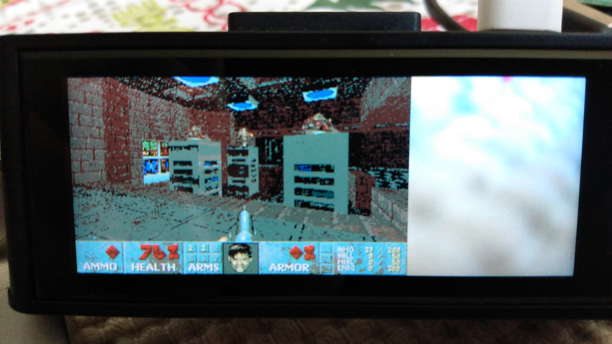
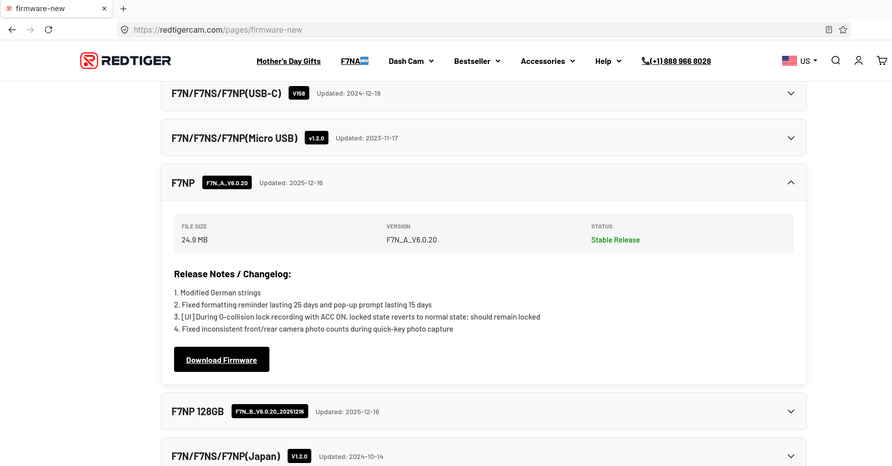
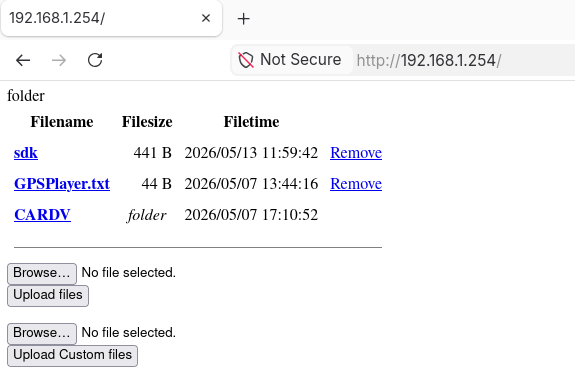
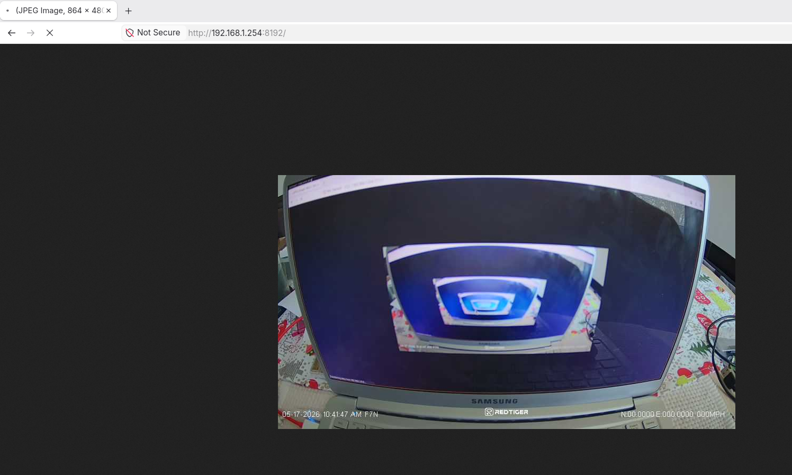
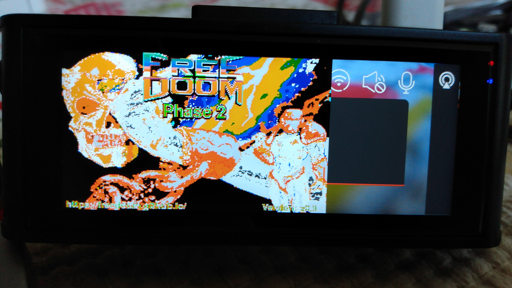
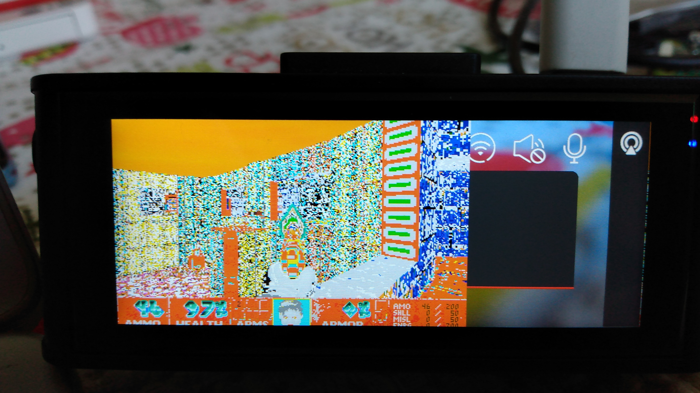
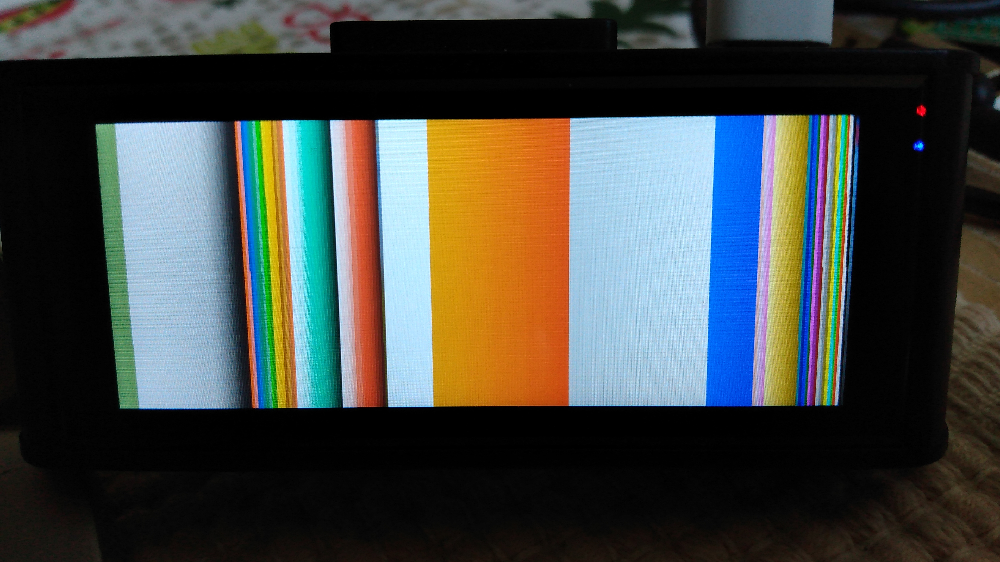
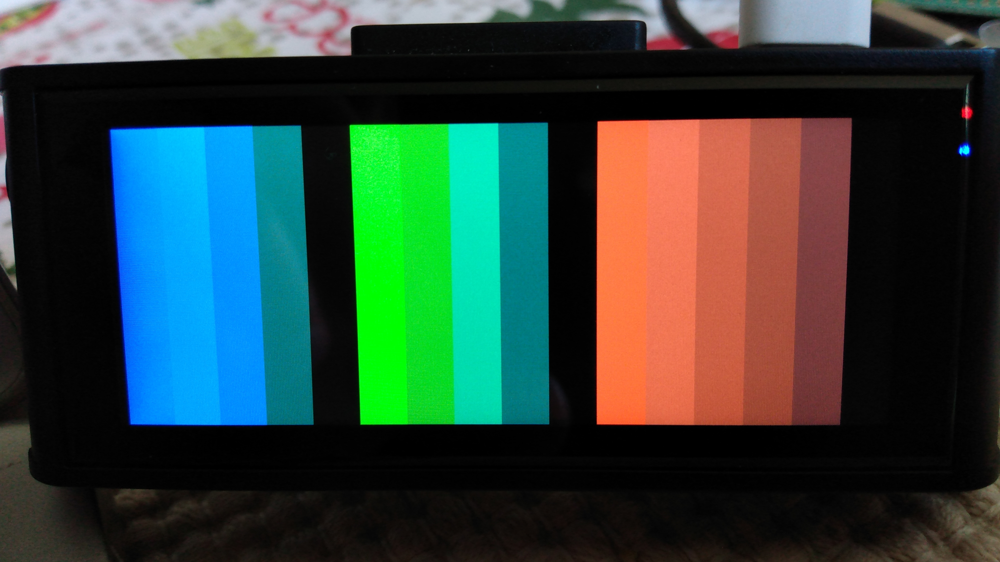
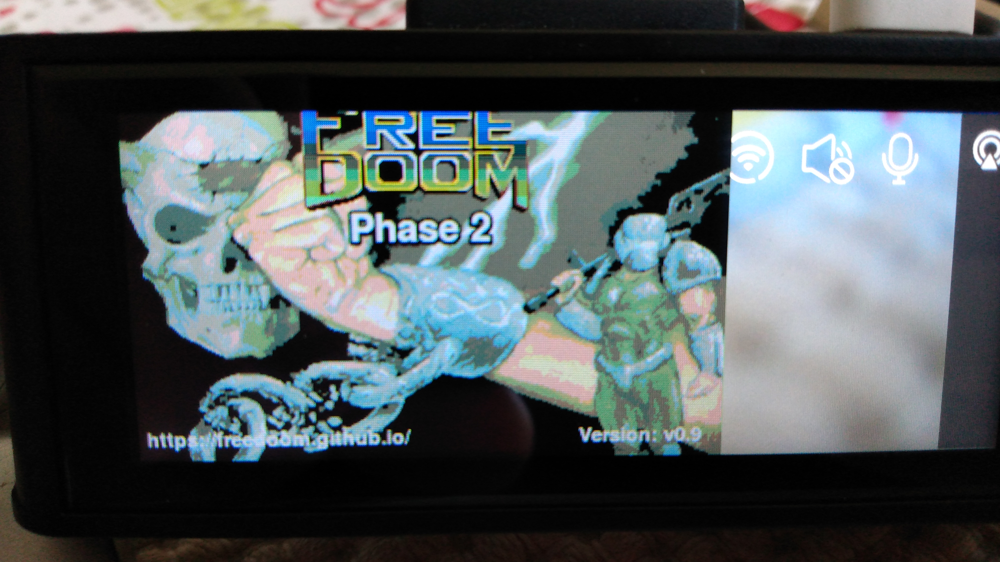

# Doom on a Redtiger F7NP Dashcam

Exactly as it says on the box: Doom running on a dashcam! With a Wi-Fi connected Linux PC to use as a keyboard, you can actually play Doom on a Redtiger F7NP dashcam.

This port is built off of Doom Generic, found here: https://github.com/ozkl/doomgeneric

See `demo_gameplay.mp4` for a gameplay demo.



## Wishlist

Potential areas of improvement:
* Better colors even in spite of the framebuffer's limited palette
* Sound - some analysis of the main application suggests it's not exactly trivial
* Perhaps some additional cleanup of debug messages and whatnot in the code

## Build Instructions

Statically-linked Doom Generic (`doomgeneric-elf`) and keyboard client (`keyclient`) binaries can be found under `prebuilt/` if you don't want to build them yourself.


To build Doom Generic yourself, you will require `clang` and GCC for `arm-none-linux-gnueabihf`. The Redtiger F7NP runs on a 32-bit ARM processor running Linux and supporting hardware floating point instructions. The keyboard client runs on your Linux PC, so make sure that GCC is installed for it as well.


These instructions assume that the ARM binutils and GCC are of the architecture `arm-none-linux-gnueabihf` and that libc and other necessary libraries are installed at `/usr/arm-none-linux-gnueabihf/libc`. If this is not the case, you will need to modify `Makefile.arm_linuxvt` to point to the correct installation directories.


To build the project:
```
// Clone doomgeneric.
$ git clone https://github.com/ozkl/doomgeneric

// Copy the necessary files to doomgeneric's source directory.
$ cp doomgeneric.h doomgeneric/doomgeneric/
$ cp doomgeneric_linuxvt_custom.c doomgeneric/doomgeneric/
$ cp Makefile.arm_linuxvt doomgeneric/doomgeneric/

// Enter doomgeneric's source directory and build it, then move it up and go back.
$ cd doomgeneric/doomgeneric/
$ make -f Makefile.arm_linuxvt
$ mv doomgeneric ../../doomgeneric-elf
$ cd ../../

// Compile the keyboard client.
$ gcc -static -o keyclient keyclient.c
```

## How to Use

It is recommended that, unless you lack the space to do so, you first remove the MicroSD card from your dashcam. Due to the way the overlay is drawn, this will lead to some flickering; you can avoid that by removing the MicroSD card and waiting for the `SD card not installed` dialog to show up.


First, connect your PC to your dashcam via Wi-Fi. The instructions are well-known and will not be repeated here. Once you are connected, the dashcam should have a static IP address of `192.168.1.254`.


Next, install Doom Generic and your Doom WAD onto the dashcam, and then execute Doom Generic. Note that my style is to use Freedoom and the instructions assume that is what is in use, but the original Doom (+ shareware version) and Doom II WADs should also work fine.
The transfer is done via FTP as `root`, with no password. The FTP root is at `/mnt/sd` on the dashcam. There should be ~70 MiB available, but if there is insufficient space available on the dashcam's internal memory, then you can store the files on the MicroSD card which is mounted at `/mnt/sd2`.
```
// Copy doomgeneric-elf and freedoom2.wad to the dashcam.
$ ftp root@192.168.1.254
<no password>
ftp> put doomgeneric-elf
ftp> put freedoom2.wad
ftp> quit

// Get onto the device and start Doom Generic.
// Once it's started, you can press CTRL+C to exit.
$ telnet 192.168.1.254
<login: "root", no password>
root@NVTEVM:~$ cd /mnt/sd
root@NVTEVM:/mnt/sd$ chmod +x ./doomgeneric-elf
root@NVTEVM:/mnt/sd$ ./doomgeneric-elf
```

**WARNING: Do not kill the** `cardv` **process!** This is the main dashcam process and it pets the watchdog regularly, so if you kill it, the dashcam will reset shortly after.


Now run the keyboard client on your PC with no arguments to take control of the game. The keyboard will be completely seized by the keyboard client while active; press SHIFT+G to exit at any time.
```
$ chmod +x ./keyclient
$ ./keyclient
<SHIFT+G to exit while the client is running>
```

# Writeup

For the most part, this was easier than I expected. This device offers no resistance in accessing a root shell and transferring files, and Doom Generic requires that only five functions be implemented. However, there were some inconveniences encountered.

## Obtaining and Viewing Firmware

The first step for anybody who wants to reverse engineer a device is to obtain its firmware somehow. The methods can vary: finding the dumped firmware online, finding the device's online firmware update endpoint, dumping the flash from U-Boot through a UART shell, physically connecting to the SPI flash if the pins are exposed and trying to read it or sniff its traffic, desoldering the flash if it's a BGA chip, etc. If the firmware is encrypted, then it will be necessary to find a way to decrypt it, probably necessitating hardware access.


Luckily for me, Redtiger keeps device firmware accessible via their website.



Once you extract the firmware binary from the archive, you can see that its contents are in plaintext, and there is a UBI image containing the device's filesystem.
```
$ unzip F7N_A_V6.0.20_20251216.zip
Archive:  F7N_A_V6.0.20_20251216.zip
  inflating: FWF7NPA.bin             

$ binwalk FWF7NPA.bin

                                                                                            /tmp/FWF7NPA.bin
--------------------------------------------------------------------------------------------------------------------------------------------------------------------------------------------------------
DECIMAL                            HEXADECIMAL                        DESCRIPTION
--------------------------------------------------------------------------------------------------------------------------------------------------------------------------------------------------------
188                                0xBC                               Device tree blob (DTB), version: 17, CPU ID: 0, total size: 23405 bytes
564684                             0x89DCC                            CRC32 polynomial table, little endian
565708                             0x8A1CC                            CRC32 polynomial table, little endian
759916                             0xB986C                            JPEG image, total size: 5577 bytes
765496                             0xBAE38                            JPEG image, total size: 5265 bytes
770764                             0xBC2CC                            JPEG image, total size: 6165 bytes
879356                             0xD6AFC                            uImage firmware image, header size: 64 bytes, data size: 3123288 bytes, compression: none, CPU: ARM, OS: Linux, image type: OS 
                                                                      Kernel Image, load address: 0x8000, entry point: 0x8000, creation time: 2025-12-16 10:12:21, image name: "Linux-4.19.91"
4002812                            0x3D13FC                           UBI image, version: 1, image size: 33947648 bytes
--------------------------------------------------------------------------------------------------------------------------------------------------------------------------------------------------------

Analyzed 1 file for 85 file signatures (187 magic patterns) in 77.0 milliseconds
```


I wasn't able to find a way to mount UBI filesystems on my workstation (obligatory "I use Arch BTW"); I had to use ubidump (https://github.com/nlitsme/ubidump) to unpack the filesystem after I extracted it from the binary.
```
$ dd if=FWF7NPA.bin of=filesystem.ubi bs=4002812 skip=1
8+1 records in
8+1 records out
33947712 bytes (34 MB, 32 MiB) copied, 0.0110353 s, 3.1 GB/s

$ python3 ubidump.py -s rootfs filesystem.ubi
==> filesystem.ubi <==
1 named volumes found, 2 physical volumes, blocksize=0x20000
== volume b'rootfs' ==
unknown magic: ffffffff
most recent master at 1000
saved 1233 files
```


Now we can take a look inside. The first thing I instinctively searched for was the main application. Judging by the enormous size, I correctly guessed that `/usr/bin/cardv` was the main dashcam process. Although I have no business with this program right now, it helps to know it should the need arise to understand how it interacts with the rest of the system.
```
$ ls -la rootfs/rootfs/usr/bin
[...]
lrwxrwxrwx 1 chainmanner chainmanner       17 May 17 10:57 bzcat -> ../../bin/busybox
lrwxrwxrwx 1 chainmanner chainmanner       17 May 17 10:57 bzip2 -> ../../bin/busybox
lrwxrwxrwx 1 chainmanner chainmanner       17 May 17 10:57 cal -> ../../bin/busybox
-rw-r--r-- 1 chainmanner chainmanner 11161080 May 17 10:57 cardv
lrwxrwxrwx 1 chainmanner chainmanner       17 May 17 10:57 chpst -> ../../bin/busybox
lrwxrwxrwx 1 chainmanner chainmanner       17 May 17 10:57 chrt -> ../../bin/busybox
lrwxrwxrwx 1 chainmanner chainmanner       17 May 17 10:57 chvt -> ../../bin/busybox
[...]
```


Next, I though to look for quick wins and access methods, like an active telnet daemon. Telnet servers in embedded devices are not unheard of, for recovery and other purposes, but usually they're protected with a backdoor password. Searching for the string "telnet" in the files under `/etc` shows a result in `/etc/init.d/S25_Net`: the telnet daemon is started at the end of this script, and based on `/etc/init.d/rcS`, this init script seems to always be run, just like the others.
```
$ grep -r -C4 rootfs/
grep: rootfs/rootfs/usr/lib/libcrypto.so.1.0.0: binary file matches
--
rootfs/rootfs/etc/inetd.conf-
rootfs/rootfs/etc/inetd.conf-# These are standard services.
rootfs/rootfs/etc/inetd.conf-#
rootfs/rootfs/etc/inetd.conf-#ftp	stream	tcp	nowait	root	/usr/sbin/tcpd	in.ftpd
rootfs/rootfs/etc/inetd.conf:#telnet	stream	tcp	nowait	root	/sbin/telnetd	/sbin/telnetd
rootfs/rootfs/etc/inetd.conf-#nntp	stream	tcp	nowait	root	tcpd	in.nntpd
rootfs/rootfs/etc/inetd.conf-#smtp  stream  tcp     nowait  root    tcpd    sendmail -v
rootfs/rootfs/etc/inetd.conf-#
rootfs/rootfs/etc/inetd.conf-# Shell, login, exec and talk are BSD protocols.
--
rootfs/rootfs/etc/init.d/S25_Net-	fi
rootfs/rootfs/etc/init.d/S25_Net-fi
rootfs/rootfs/etc/init.d/S25_Net-
rootfs/rootfs/etc/init.d/S25_Net-echo "net" > /proc/nvt_info/bootts
rootfs/rootfs/etc/init.d/S25_Net:telnetd
grep: rootfs/rootfs/bin/busybox: binary file matches
```


But if we take a look at `/etc/passwd`, we can see that no password for logging in as `root` is required!
```
$ cat rootfs/rootfs/etc/passwd
root::0:0:root:/root:/bin/sh
```


## Getting a Shell on the Device

Is it really that simple? Just login via telnet without a password for root? Only one way to find out.


After connecting to the dashcam via Wi-Fi, I found its IP address and port-scanned it. In addition to telnet, Nmap showed the presence of an FTP server, plus an HTTP daemon and two other services.
```
# nmap -sn 192.168.1-255
Starting Nmap 7.99 ( https://nmap.org ) at 2026-05-17 11:04 -0400
Nmap scan report for 192.168.1.254
Host is up (0.0052s latency).
MAC Address: 78:BE:81:[XX:XX:XX] (FN-Link Technology)
Nmap scan report for 192.168.1.21
Host is up.
Nmap done: 255 IP addresses (2 hosts up) scanned in 17.01 seconds

# nmap -n -p1-65535 192.168.1.254
Starting Nmap 7.99 ( https://nmap.org ) at 2026-05-17 11:07 -0400
Nmap scan report for 192.168.1.254
Host is up (0.0037s latency).
Not shown: 65530 closed tcp ports (reset)
PORT     STATE SERVICE
21/tcp   open  ftp
23/tcp   open  telnet
80/tcp   open  http
3333/tcp open  dec-notes
8192/tcp open  sophos
MAC Address: 78:BE:81:[XX:XX:XX] (FN-Link Technology)

Nmap done: 1 IP address (1 host up) scanned in 7.14 seconds
```


The HTTP server on port `80` allows access to the contents of the MicroSD card when there is one mounted.



The service on `3333` sends a stream of telemetry data - GPS coordinates, speed, gyroscope measurements, and so on - in XML format, with no fluff. There's no GPS module connected, so obviously the GPS-related parameters are empty.
```
$ nc -v 192.168.1.254 3333
Connection to 192.168.1.254 3333 port [tcp/dec-notes] succeeded!
<?xml version="1.0" encoding="UTF-8" ?>
<Function>
<Cmd>8002</Cmd>
<Status>0</Status>
<String>2000/00/00 00:00:00 NA NA NA km/h 0.00 NA 0 x:0.941 y:-0.008 z:0.219 </String>
</Function><?xml version="1.0" encoding="UTF-8" ?>
<Function>
<Cmd>8002</Cmd>
<Status>0</Status>
<String>2000/00/00 00:00:00 NA NA NA km/h 0.00 NA 0 x:0.941 y:-0.004 z:0.227 </String>
</Function><?xml version="1.0" encoding="UTF-8" ?>
<Function>
<Cmd>8002</Cmd>
<Status>0</Status>
<String>2000/00/00 00:00:00 NA NA NA km/h 0.00 NA 0 x:0.941 y:-0.008 z:0.215 </String>
</Function><?xml version="1.0" encoding="UTF-8" ?>
<Function>
[...]
```


The service on `8192` is also an HTTP endpoint, outputting the dashcam's video feed as a stream of JPEG images. No audio, obviously.



The FTP server permits me to login as root with no password, confirming my hypothesis of a passwordless root login.
```
$ ftp root@192.168.1.254
Connected to 192.168.1.254.
220 Operation successful
331 Please specify password
Password:
230 Operation successful
Remote system type is UNIX.
Using binary mode to transfer files.
ftp> ls
200 Operation successful
150 Directory listing
total 0
-rw-rw-r--    1 0        0                0 May 20  2025 .exist
226 Operation successful
ftp> quit
221 Operation successful
```


So that's it? I can just login as root over telnet, with no opposition?
```
$ telnet 192.168.1.254
Trying 192.168.1.254...
Connected to 192.168.1.254.
Escape character is '^]'.

NVTEVM login: root
NVTEVM Linux shell...
root@NVTEVM:~$ id
uid=0(root) gid=0(root) groups=0(root)
root@NVTEVM:~$ ls -la /
total 24
drwxrwxr-x   14 root     root          1192 May 13 12:26 .
drwxrwxr-x   14 root     root          1192 May 13 12:26 ..
drwxrwxr-x    2 root     root          5344 Jul 15  2025 bin
drwxr-xr-x    3 root     root          4580 May 17 09:48 dev
drwxrwxr-x    6 root     root          1912 Jul 15  2025 etc
-rwxrwxr-x    1 root     root           561 May 20  2025 init
drwxrwxr-x    3 root     root          2896 Jul 15  2025 lib
lrwxrwxrwx    1 root     root            11 Jul 15  2025 linuxrc -> bin/busybox
drwxrwxr-x   13 root     root           880 May 17  2025 mnt
dr-xr-xr-x  163 root     root             0 Jan  1  1970 proc
drwxrwxr-x    2 root     root           304 May 16 22:06 root
drwxrwxr-x    2 root     root          4960 Jul 15  2025 sbin
-rwxrwxr-x    1 root     root         18884 May 20  2025 stack_example
dr-xr-xr-x   11 root     root             0 May 17 09:48 sys
-rw-r--r--    1 root     root             0 May 13 12:26 test
drwxrwxrwt    2 root     root            40 May 17 10:16 tmp
drwxrwxr-x    7 root     root           480 Jul 15  2025 usr
drwxrwxr-x    7 root     root           480 May 17  2025 var
root@NVTEVM:~$ exit
Connection closed by foreign host.
```


Yep. That's all there is to it. Now I have a root shell on the device.

## Porting Doom Generic

Doom Generic was designed to make porting the already quite portable Doom engine even easier. Only five functions need to be implemented: initialization, frame drawing, sleeping, getting the tick count, and getting the keyboard events. Since this is a Linux system, I chose to start off using the code in `doomgeneric_linuxvt.c` and modify it to suit my needs. Thus I can focus only on implementing frame drawing and keyboard handling, and maybe initialization if anything different must be done there, but in this case there was nothing more to do in that regard.


The port code is available in `doomgeneric_linuxvt_custom.c` and should hopefully explain enough.

## Displaying the Game's Graphics

Much like every other Linux system with graphics, this dashcam has a framebuffer. There's little complicated about writing to `/dev/fb0`, but displaying the game graphics in a satisfactory manner needed some additional steps.


The dashcam uses the framebuffer to render the UI overlay: recording dot, current time, recording time, UI button meanings, message boxes, and so on. The dashcam's screen resolution appears to be `960x384`, but is actually `384x1920`; the image is rotated, and the virtual resolution is actually of double height. Naturally, that means I'd need to translate and rotate the image to make it look proper on the actual screen.
```
root@NVTEVM:~$ fbset

mode "384x960-0"
        # D: 0.000 MHz, H: 0.000 kHz, V: 0.000 Hz
        geometry 384 960 384 1920 8
        timings 0 17 18 17 18 2 2
        accel false
        rgba 8/16,8/8,8/0,8/24
endmode
```


Based on some testing - namely grabbing `/dev/fb0` and replaying it - it seems that the framebuffer is split into two "canvasses", one displayed during odd seconds and one shown during even seconds. If you try it yourself, you will notice that sometimes the overlay with a recording time of odd seconds is shown, and sometimes the overlay with a recording time of even seconds is shown. I'm not sure what's the purpose of doing so; if I had to guess, it's for performance optimization somehow. Whatever the reason, this means that the game display needs to be drawn onto both "canvasses" at the same time. Not a problem.


As can be seen above, the framebuffer has a depth of 8 bits, meaning 1 byte per pixel, meaning it likely uses a colormap of 256 colors. If we try to render the game naively by specifying the `CMAP256` preprocessor definition in the compiler flags, we can see that it's pretty hideous:




That's to be expected, because the colormaps of the game and the framebuffer differ. Perhaps there's an easy way to map the game's colors to the framebuffer's? Unfortunately, no. This is a test image, generated by creating "slices" from right (which is actually the top of the framebuffer) to left (framebuffer's bottom) of incrementing pixel values:



The Python script used to generate that, if it's of any interest:
```
#!/usr/bin/python3

fb_len = 737280

with open("colormap.img", "wb") as file:
	for curCanvas in range(2):
		for j in range(256):
			for i in range(fb_len // 512):
				file.write((j & 0xFF).to_bytes(length=1,byteorder="little"))
```


`0x00` is transparent, `0x01` is black, `0x02` is white, `0x03` is strong red, `0x04` is strong green, `0x05` is cyan, and so on. Then you have ranges of orange, red, teal, and gray. There is no discernible general pattern to this colormap. For the dashcam devs, this probably wasn't an issue as the UI and overlay are pretty simple when it comes to colors, but for me that makes drawing properly-colored pixels harder.


I didn't really want to try and map the game's colormap to the framebuffer's, especially since it doesn't seme like all colors can be represented. An odd idea eventually crossed my mind: since the game's resolution can go down to `320x200` and a `384x960` canvas is accommodating enough for double that, why not try to emulate an LED screen this way? That is, render the game in true color, and for each game pixel, draw four pixels: one red, one green, one blue, and one stays black, and the RGB pixels would be of different shades. Since the color patterns in the framebuffer's colormap are inconsistent, I would have to select by hand the individual shades of green and blue, though not of red since there's a nice gradient available. This would still not look great given the limited color ranges, but at least the game's display wouldn't make one's eyes bleed.


To test my hypothesis, I quickly wrote another Python script to draw a composite color across the screen. Pardon the ugliness, I just needed to know that this idea was viable. The code below is meant to make the screen white.
```
#!/usr/bin/python3

height = 960
width = 384

with open("colormap.img", "wb") as file:
	for curCanvas in range(2):
		for y in range(height):
			for x in range(0, width, 4):
				if y & 1:
					file.write((0x03).to_bytes(length=1,byteorder="little"))
					file.write((0x04).to_bytes(length=1,byteorder="little"))
					file.write((0x0E).to_bytes(length=1,byteorder="little"))
					file.write((0x01).to_bytes(length=1,byteorder="little"))
				else:
					file.write((0x0E).to_bytes(length=1,byteorder="little"))
					file.write((0x01).to_bytes(length=1,byteorder="little"))
					file.write((0x03).to_bytes(length=1,byteorder="little"))
					file.write((0x04).to_bytes(length=1,byteorder="little"))
```


And it worked! Although the screen was intended to be white, it was a satisfactory shade of grey. So this idea wasn't ridiculous. Only thing to note is that there's a visible flickering on the display, but that's nothing to worry about. After some inconvenient searching of color shades, I settled on the below:



The Python script used to generate the above test image:
```
#!/usr/bin/python3

fb_len = 737280//2

colors = (
	# Red
	0x01, 0xA1, 0xA2, 0xA3, 0xA4, 0x03,
	# Green
	0x01, 0xB1, 0xCA, 0xC7, 0xC8,
	# Blue
	0x01, 0xB1, 0xCD, 0xCC, 0x20,
)

with open("colormap.img", "wb") as file:
	for curCanvas in range(2):
		for curColor in colors:
			for i in range(fb_len // len(colors)):
				file.write((curColor & 0xFF).to_bytes(length=1,byteorder="little"))
```


And so, after implementing the RGB screen emulation method, though still not perfect, the game's rendered output no longer assaults the user's vision.



Perhaps I could have reverse engineered the main `cardv` application to see how it renders the camera feed properly, but I wasn't interested in identifying and tracing the usage of all the video-related device files under `/dev`. Not for a novelty project, at least.

## Controlling Doom Using the PC's Keyboard

The last step is to actually make Doom playable by the user. There are four buttons on the dashcam: power, up, menu/select, and down. These are not sufficient to properly play the game. But, since we're already connected to the dashcam over Wi-Fi to transfer the game files and start Doom Generic anyway, why not use the PC's keyboard to control it? The example port `doomgeneric_linuxvt.c` already has code to grab the keyboard device and catch events, so the hardest work was already done. Now I just needed to add a listener to Doom Generic and create a separate client program on the PC to transmit key presses.


The keyboard client's code is in `keyclient.c`. Easy enough to understand: it takes each key press/release event as is done in `doomgeneric_linuxvt.c` and, after it's converted to a Doom-recognized key, sends it to `192.168.1.254` on port `1337`. (In hindsight I should have picked a cheekier destination port, like `666`. You know, since it's Doom.)


The only catch with the keyboard client is that because it seizes the keyboard, you cannot press `CTRL+C` to exit. I added a snippet such that pressing `SHIFT+G` exits the program, since that key combo is not bound to anything in the original Doom engine.


The receiver code in Doom Generic is equally simple: just need to start a new thread, listen for correctly-formatted key client messages, and add the event to a queue of key events, each of which is processed whenever `DG_GetKey()` is invoked. Mutual exclusion must be used for that queue, of course, and any related variables.


Some padding `0xA5/0x5A` bytes are prepended and appended to the key value in the UDP message to prevent unintended key events from accidental transmissions to UDP port `1337` - it was just a force of habit to add this safety in - but there's otherwise nothing noteworthy to mention about this interaction.
